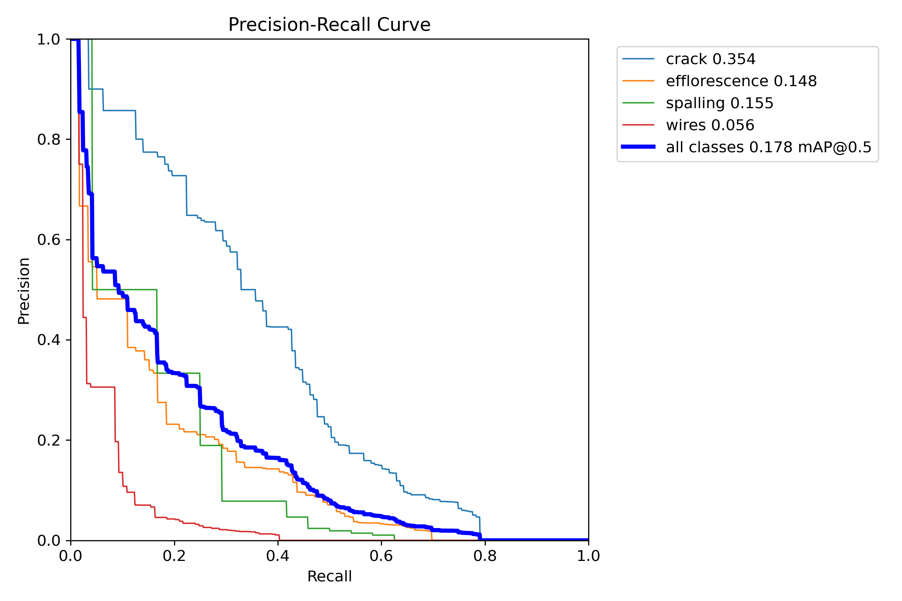

# Bridging the Analog-Digital Divide in Façade Inspection and Maintenance

## AI-Enabled Workflow for Façade Defect Mapping and Digital Twin Integration

This project addresses the gap between manual façade inspection and BIM-integrated digital twin workflows. The aim is to transform façade imagery into structured, traceable condition information that can support maintenance planning and future digital twin integration.

The current repository implements the **Detect** stage of the workflow using a YOLOvXXX-based crack detection pipeline. Future stages will extend this toward structured outputs, BIM association, and condition-aware asset records.

## Workflow Stages
1. Capture - source-agnostic image acquisition
2. Detect - AI-based façade defect localisation
3. Structure - convert detections into structured measurable outputs
4. Integrate - associate outputs with BIM/model elements
5. Assess - support condition tracking and maintenance decisions

## Current Scope
This repository currently focuses on the **Detect** stage of the proposed workflow.

### Implemented
- Single-class façade crack detection using YOLOvXXX
- Google Colab reproducibility workflow
- Validation metrics, PR curve, confusion matrix, and prediction evidence
- Roboflow dataset integration

### Planned Future Extensions
- Crack width estimation and structured defect parameters
- Confidence-aware output schema (JSON / CSV)
- BIM / Revit element association
- Condition-aware digital twin integration

## Research Focus

The broader project investigates whether an image-based façade inspection pipeline can provide reliable, decision-support condition data suitable for future BIM-based digital twin integration.

In the current repository, the practical focus is:
- Can YOLOvXXX reliably detect façade cracks on held-out images?
- Can the detection pipeline be reproduced by a third party in Google Colab?
- Can the detection evidence form a valid foundation for later BIM-linked workflow stages?
  
## Workflow Mapping

| Workflow Stage | Status in this Repository | Evidence |
|---|---|---|
| Capture | Partially addressed | Roboflow dataset and façade image inputs |
| Detect | Implemented | YOLOvXXX notebook, metrics, PR curve, confusion matrix |
| Structure | Planned | future structured output schema |
| Integrate | Planned | future BIM / Revit association workflow |
| Assess | Planned | future condition intelligence and maintenance reporting |

## Dataset

Source: Roboflow  
Project: facade-cracks  
Format: YOLOvXXX  
Split: 80% Train / 20% Validation  
Classes: crack  
Dataset link : https://universe.roboflow.com/ahmad-younis-s-workspace/facade-cracks

## Model Configuration

Model: YOLOv8s  
Epochs: 50  
Image size: 640  
Batch size: 16  
Runtime: Google Colab (T4 GPU)

All annotations were reviewed for consistency.

## Results Summary

Final Performance:
| Metric | Value |
|---|---|
| Model | YOLOv8s |
| Task | Single-Class Crack Detection |
| mAP@0.5 | 0.825 |
| Epochs | 50 |
| Image Size | 640 |
| Batch Size | 16 |
| Runtime | Google Colab (T4 GPU) |

## Evaluation Visuals

### Precision-Recall Curve

### Confusion Matrix

## Model Weights 
The trained model weights (best.pt) are available here:
[Download Model Weights] (https://github.com/aesawy83-ai/AI-Facade-Inspection/releases/tag/%23FMP)

## Reproduce in Google Colab

1. Open `notebooks/ AI-Facade-Inspection.ipynb`  in Colab.
2. Runtime → Change runtime type → GPU.
3. Run all cells.
4. Training outputs will be saved in `/runs/detect/`.

## Reproducibility Proof

Last successful run: [3/4/2026]  
Runtime: Google Colab (T4 GPU)  
Epochs: 50  
Model: YOLOv8s  
Classes: crack 
Expected runtime: ~15–20 minutes

## Evidence

Training curves: `/results/curves/`  
Validation predictions: `/results/predictions_val/`  
New image predictions: `/results/predictions_new/`

## Governance & Limitations

This model is intended for inspection assistance only.
Human validation is required before structural decisions.

See:
- `/docs/error_analysis.md`
- `/docs/governance_checklist.md`

