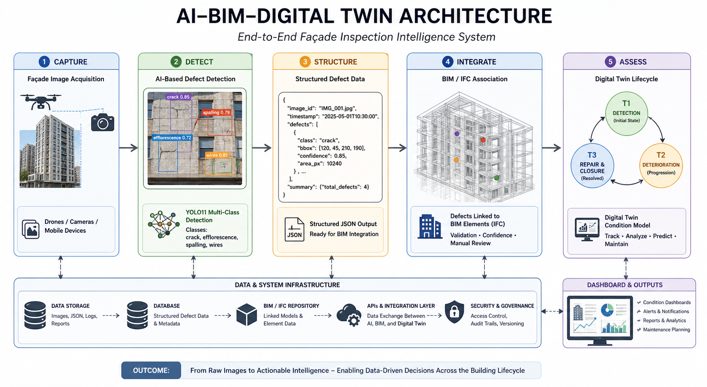

<p align="center">
  
</p>

<h1 align="center"><b>AI-Enabled Multi-Class Façade Defect Detection for AECO Workflows</b></h1>

<p align="center">
  
  
  
  
  
</p>

---

## 📖 Introduction

This repository implements an **AI-enabled façade inspection system** focused on the **Detect stage**, forming the foundation for **BIM-integrated Digital Twin workflows**.

The system uses a **YOLO11 multi-class object detection pipeline**, trained in **Google Colab** using a **Roboflow dataset**, to automatically identify façade defects from inspection imagery.

This repository focuses on the **Detect → Structure stages**, while defining the architecture required for downstream **BIM integration and Digital Twin lifecycle management**.

---

## 🧭 System Workflow Overview

```text
Capture → Detect → Structure → Integrate → Assess
```

### 🔗 Implementation Mapping

```text
Image → YOLO Detection → Structured JSON → BIM / IFC → Digital Twin → Dashboard
```

---

## 🧩 System Architecture (End-to-End)



*Figure — End-to-end AI → BIM → Digital Twin system architecture*

This diagram provides a system-level view of how façade inspection data flows
from image acquisition through AI detection, structured data generation,
BIM integration, and Digital Twin lifecycle management.

---

## 🔷 AI to Digital Twin Pipeline


*Figure — AI-to-Digital Twin inspection pipeline*

This pipeline transforms inspection imagery into structured defect intelligence
for BIM integration and Digital Twin lifecycle tracking.

---

## 🟢 BIM Association Logic | 🟡 Digital Twin Condition Model

<table>
<tr>

<td width="50%">

### 🟢 BIM Association Logic


*Figure — BIM association decision logic*

* Validation-based linking (no forced association)
* Confidence-driven decision workflow
* Manual review for uncertain detections

</td>

<td width="50%">

### 🟡 Digital Twin Condition Model


*Figure — Digital Twin condition state lifecycle*

* **T1** → Detection
* **T2** → Deterioration
* **T3** → Repair & closure

</td>

</tr>
</table>

---

## 🔗 Integrated System View

This system operates through three tightly coupled layers:

* **AI Pipeline** → generates structured defect data from images
* **BIM Layer** → anchors defects to physical building elements
* **Digital Twin Layer (Condition Model)** → tracks condition evolution over time

Together, these layers form a complete **inspection intelligence system linking AI detection, BIM-based spatial context, and Digital Twin lifecycle tracking**.

This enables future **predictive maintenance through condition trend analysis**.

---

## 📊 Results Summary

| Metric       | Value |
| ------------ | ----: |
| mAP@0.5      |  0.18 |
| mAP@0.5:0.95 |  0.09 |
| Precision    |  0.28 |
| Recall       |  0.21 |

### Class-wise AP@0.5

| Class         |    AP |
| ------------- | ----: |
| crack         | 0.354 |
| efflorescence | 0.148 |
| spalling      | 0.155 |
| wires         | 0.056 |

These results represent the detection performance that feeds into the downstream
BIM-linked Digital Twin condition model.

---

## 📈 Evaluation Visual Evidence

| PR Curve                         | Confusion Matrix                         |
| -------------------------------- | ---------------------------------------- |
|  |  |

| Training Results                | F1 Curve                         |
| ------------------------------- | -------------------------------- |
|  |  |

---

## 📂 Repository Structure

```text
assets/              → diagrams and visual assets  
docs/                → documentation and system design  
notebooks/           → training and experimentation  
results/             → model outputs and evaluation  
README.md            → project overview  
repository_guide.md  → navigation and explanation  
```

---

## 📘 Documentation Hub

* docs/README.md
* docs/problem_framing.md
* docs/research_question.md
* docs/class_definitions.md
* docs/dataset_strategy.md
* docs/error_analysis.md
* docs/future_integration.md
* [🧠 Digital Twin Integration Strategy](docs/digital_twin_integration.md)

---

## 🧭 Repository Guide

For a structured walkthrough of the project:

👉 See `repository_guide.md`

---

## ⚙️ Training Configuration

| Parameter         | Value        |
| ----------------- | ------------ |
| Model             | YOLO11s      |
| Framework         | Ultralytics  |
| Training Platform | Google Colab |
| GPU               | T4 High RAM  |
| Epochs            | 50           |
| Image Size        | 640          |
| Batch Size        | 16           |

---

## 🔮 Future Work

* BIM / Revit linking
* IFC object tagging
* Digital Twin dashboard
* condition trend analytics
* predictive maintenance
* integration with real-time Digital Twin platforms

---

## 🏁 Final Statement

This project demonstrates how **computer vision can be integrated with BIM and Digital Twin workflows**
to enable **scalable, traceable, and lifecycle-driven façade inspection systems**.
