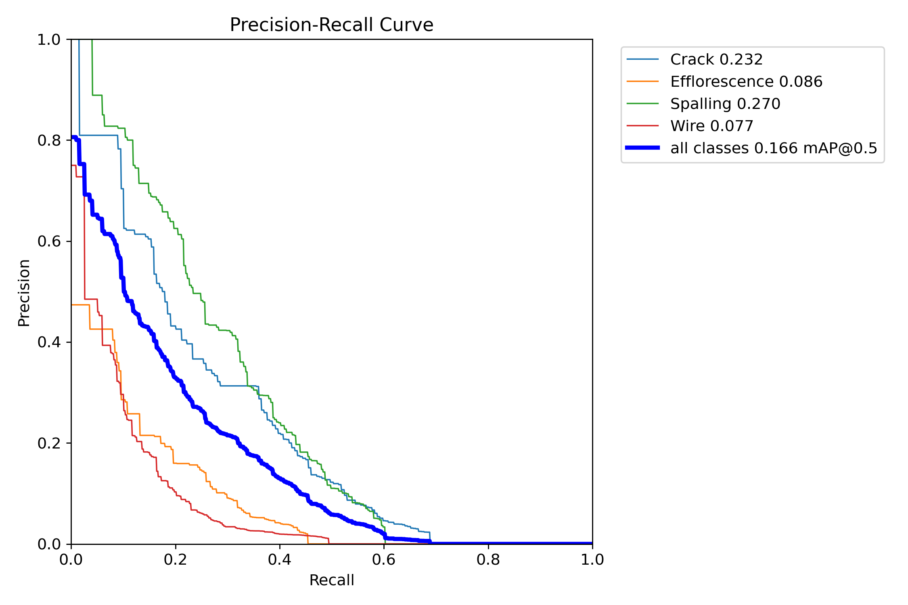
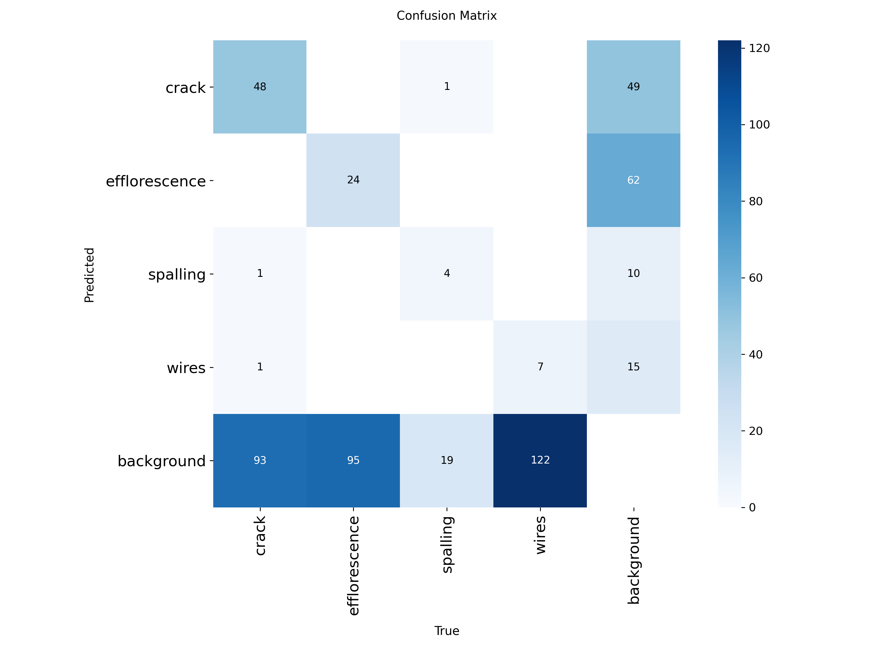
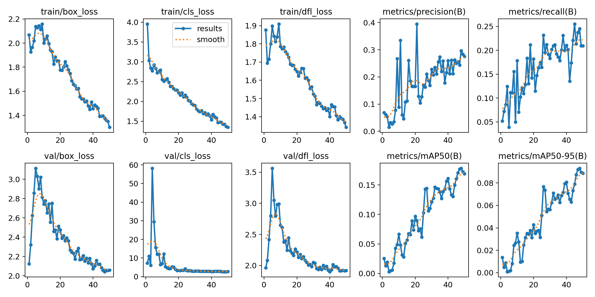
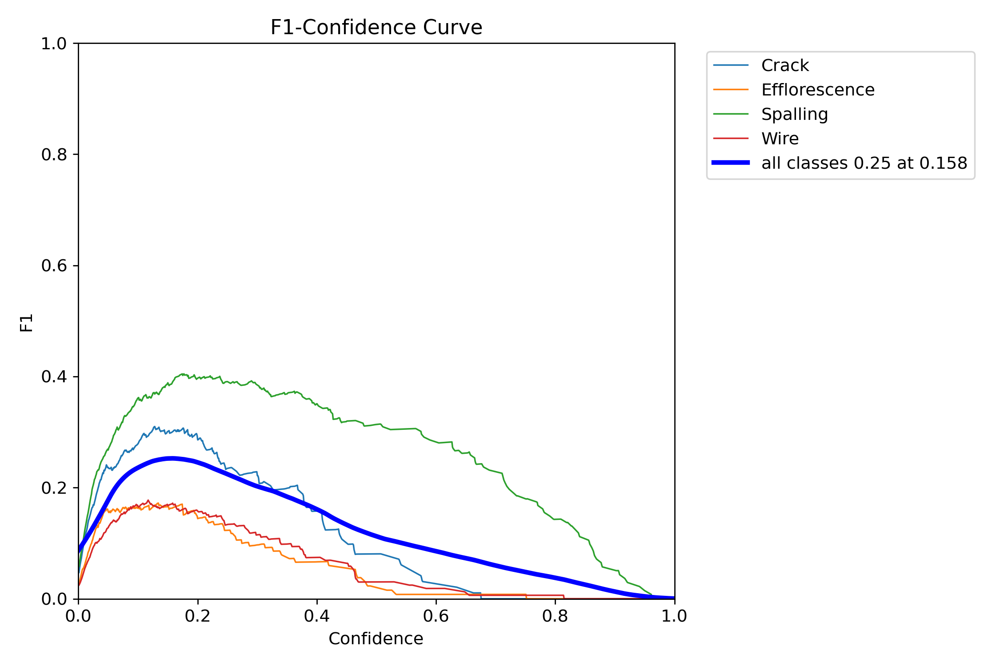
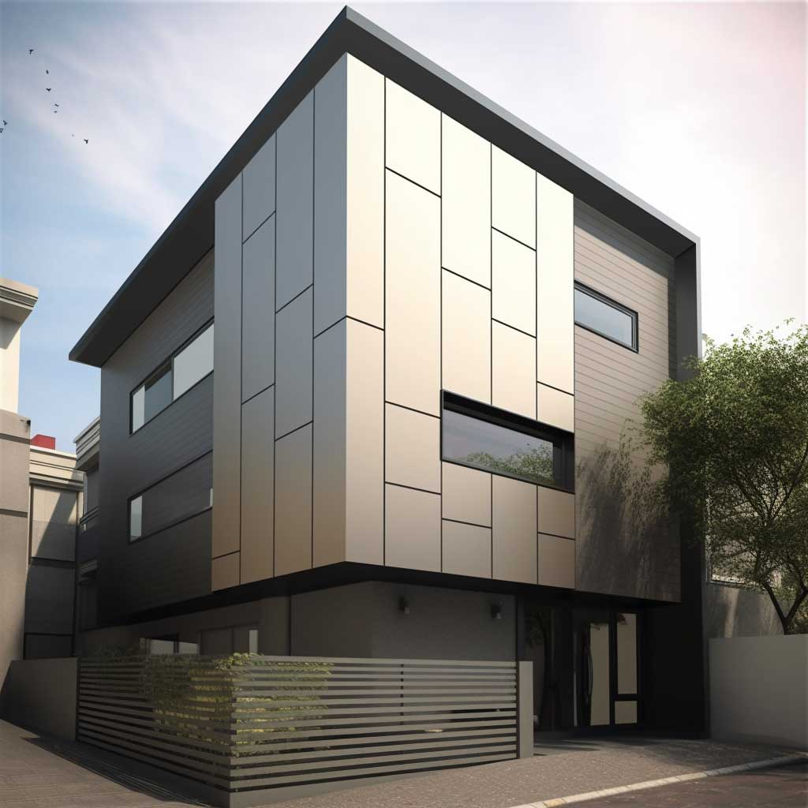

<p align="center">
  
</p>

<p align="center">
  <b>AI-Enabled Multi-Class Façade Defect Detection for AECO Workflows</b>
</p>

<p align="center">
  
  
  
  
  
</p>

---

## Introduction

This repository presents the **Detect stage** of an AI-enabled façade inspection workflow developed for a **Master’s Final Project in AI for AECO**. It implements a **YOLO11 multi-class object detection pipeline**, trained and validated in **Google Colab** using a **public Roboflow dataset**, to automatically identify visible façade defects from inspection imagery across four key classes: **Crack, Efflorescence, Spalling, and Exposed Wires**. This computer vision baseline establishes the foundation for future **BIM-linked defect intelligence, Digital Twin integration, and lifecycle-driven asset assessment workflows**.

---

##  Project Objective & Vision

Traditional façade inspection is often **manual, labor-intensive, visually subjective, difficult to scale, and weakly documented longitudinally**. This project demonstrates how **computer vision and object detection** can transform the process into a more **scalable, auditable, and evidence-driven workflow**, with a long-term vision of translating detections into **BIM-linked condition intelligence, maintenance prioritization, Digital Twin updates, and lifecycle decision support**. This repository currently focuses on the **detection layer** of the broader inspection intelligence pipeline:

> **Capture → Detect → Structure → Integrate → Assess**

<p align="center">
  
</p>

---

#  Dataset

##  Source

The dataset is publicly available on **Roboflow Universe**.

* **Workspace:** `youniss-workspace-fic2t`
* **Project:** `m10-fmp-g2-facade-detection`
* **Task:** Multi-class object detection
* **Export Format:** YOLO11
* **Version Used:** `V1`

###  Link https://universe.roboflow.com/yunisss-workspace/facade-condition-intelligence

##  Defect Taxonomy

| Class | Inspection Meaning | Typical AECO Risk |
|---|---|---|
| **Crack** | Linear fractures, surface fissures, and visible separation lines within façade materials, often indicating structural stress, shrinkage, or environmental degradation. | Moisture ingress, thermal expansion damage, structural deterioration |
| **Efflorescence** | White salt deposits and surface staining caused by moisture migration through porous materials, typically signaling persistent water penetration pathways. | Hidden moisture accumulation, material degradation, waterproofing failure |
| **Spalling** | Localized surface material loss, concrete chipping, detachment, or fragmentation, commonly associated with reinforcement corrosion or freeze–thaw damage. | Concrete failure, falling debris risk, exposed reinforcement |
| **Wires** | Exposed service cables, loose electrical lines, or visible façade-mounted wiring elements that may indicate damaged routing or incomplete installation. | Electrical hazard, safety compliance issues, visual façade degradation |

##  Dataset Strategy

The dataset follows standard **train / validation / test** splits to support:

* fair held-out evaluation
* repeatable benchmarking
* class-level AP tracking
* PR curve reproducibility

### Version freeze used in notebook

```python
version = project.version(2)
```
---

# 🤖 Model Architecture

The detector is trained using **Ultralytics YOLO11** in **Google Colab Pro (T4 GPU)**.
##  Training Configuration & Engineering Rationale

| **Parameter** | **Value** | **Description** |
|:---:|:---:|:---:|
| **Model** | YOLO11s | Lightweight high-accuracy baseline detector for efficient experimentation |
| **Framework** | Ultralytics | Production-ready modern training ecosystem with simplified deployment |
| **Training Platform** | Google Colab | Cloud-native GPU experimentation workflow with easy reproducibility |
| **GPU** | G4 High RAM | Efficient mid-scale deep learning acceleration for training |
| **Epochs** | 100 | Balanced convergence, stability, and validation monitoring schedule |
| **Image Size** | 640 | Standard object detection input resolution for façade imagery |
| **Batch Size** | 16 | Stable memory-efficient gradient batching with good throughput |
| **Early Stopping** | patience = 20 | Prevents overfitting, stagnation, and unnecessary training cycles |
| **Notebook** | `notebooks/FMP_AI_Facade_Inspection.ipynb` | End-to-end reproducible training, validation, and inference workflow |

---

#  Results Summary

| mAP@0.5 | mAP@0.5:0.95 | Precision | Recall | Crack AP | Efflorescence AP | Spalling AP | Wires AP |
|---:|---:|---:|---:|---:|---:|---:|---:|
| **00.166** | **00.09** | **00.28** | **00.21** | **00.232** | **00.086** | **00.270** | **00.077** |

---

# 📈 Evaluation Visual Evidence

## Precision–Recall Curve



## Confusion Matrix



## Training Curves



## F1 Curve



---

#  Sample Detection Outputs

## Validation Predictions


## Unseen Image Predictions




---

#  Reproducibility Workflow (Google Colab)

##  Run Instructions

1. Open notebook: `notebooks/FMP_AI_Facade_Inspection.ipynb`
2. Set runtime → **GPU**
3. Install dependencies:

```python 
!pip install ultralytics roboflow
```

4. Connect dataset:

```python
from roboflow import Roboflow

rf = Roboflow(api_key="YOUR_API_KEY")
project = rf.workspace("youniss-workspace-fic2t").project("m10-fmp-g2-facade-detection")
version = project.version(1)
dataset = version.download("yolov11")
```

5. Run all cells
6. Outputs generated under:

```text
/runs/detect/
```

Generated artifacts:

* `best.pt`
* PR curves
* confusion matrix
* validation predictions
* test predictions
* training curves

---

#  Model Weights

The final trained **YOLO11s multi-class façade defect detector** is available via GitHub Releases.

link: [Download YOLO11s.pt model weights](https://github.com/aesawy83-ai/AI-Facade-Inspection/releases/tag/v1.0)

---

#  Error Analysis

Detailed failure analysis:

`docs/error_analysis.md`

Typical failure patterns:

* thin wire misses
* crack vs stain confusion
* shadow-heavy false positives
* distant spalling misses
* low-light recall degradation

---
##  Digital Twin Integration

The full Digital Twin system design, including BIM linkage, lifecycle modelling, and system architecture, is documented here:

 [View Digital Twin Integration Strategy](docs/digital_twin_integration.md)

##  Roadmap

### Phase 1 — Detection
- [x] Multi-class YOLO11 baseline
- [x] Roboflow dataset pipeline
- [x] Colab reproducibility
- [x] GitHub documentation system

### Phase 2 — Structuring
- [x] JSON defect schema
- [x] severity scoring
- [x] asset tagging

### Phase 3 — BIM / Digital Twin
- [ ] IFC mapping
- [ ] dashboard visualization
- [ ] lifecycle analytics

---

# 📄 License

**Group_2 License**

---

# 👤 Author

**Group_2**

