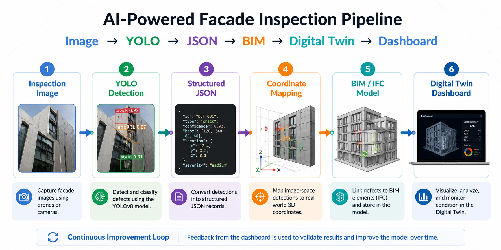
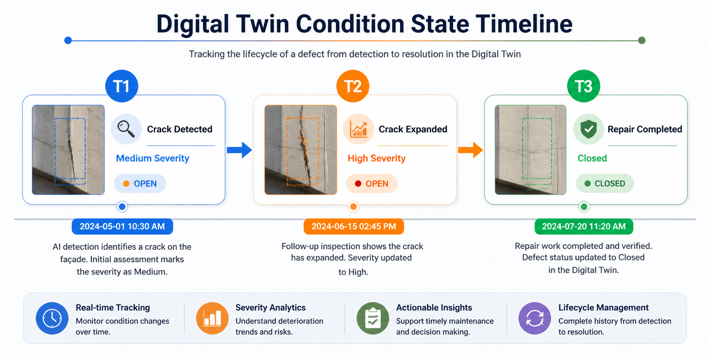

#  Digital Twin Integration Strategy

> This document defines the system architecture for extending YOLO-based façade defect detection into a **BIM-linked Digital Twin workflow** for AECO applications.

---

##  1. System Purpose

This repository implements the **Detect stage** of an AI-enabled façade inspection pipeline.

The extended goal is to transform image-based detections into:
- structured defect records  
- BIM-linked condition data  
- Digital Twin updates  
- lifecycle asset intelligence  

---

##  2. End-to-End Workflow



The workflow progresses from inspection imagery to AI-based detection, structured defect records, BIM/IFC association, Digital Twin updating, and reviewer feedback.

```text
Capture → Detect → Structure → Coordinate Mapping → Integrate → Digital Twin → Feedback
```
### Technical Pipeline Mapping

Capture → Detect → Structure → Integrate → Assess

maps to:

Image → YOLO Detection → Structured JSON → BIM / IFC → Digital Twin → Dashboard
---

##  3. Data Flow Architecture

```text
Inspection Image
    ↓
YOLO Detection
    ↓
Structured JSON Output
    ↓
Coordinate Transformation
    ↓
BIM Model (IFC / Revit)
    ↓
Digital Twin Dashboard
    ↺
User Feedback & Validation
```

---

##  4. Structured Defect Data Model

Each detection should be converted into a structured JSON record that can later be linked to BIM elements and inspection evidence.

### Example JSON

```json
{
  "defect_id": "DEF_0001",
  "element_id": "FAC-001",
  "ifc_guid": null,
  "defect_type": "crack",
  "confidence": 0.92,
  "severity": "medium",
  "bbox": [120, 340, 80, 60],
  "pixel_area": 480,
  "image_id": "IMG_0234",
  "evidence_link": "results/predictions_new/IMG_0234.jpg",
  "association_status": "pending_review",
  "location": {
    "x": null,
    "y": null,
    "z": null
  }
}
```

### Data Schema Explanation

| Field | Description |
|---|---|
| `defect_id` | Unique defect identifier |
| `element_id` | Candidate or validated BIM element reference |
| `ifc_guid` | IFC globally unique identifier, if available |
| `defect_type` | Detected façade defect class |
| `confidence` | YOLO prediction confidence |
| `severity` | Condition criticality assigned by rule or reviewer |
| `bbox` | Bounding box in image coordinates |
| `pixel_area` | Approximate image-space defect area |
| `image_id` | Source image identifier |
| `evidence_link` | Link to visual inspection evidence |
| `association_status` | BIM linking state |
| `location` | Real-world coordinate placeholder |

---

##  5. Coordinate Mapping Layer

This layer transforms image-based detections into real-world coordinates aligned with the BIM model.

### Inputs
- image coordinates in pixels  
- camera position and orientation  
- façade geometry reference  
- BIM coordinate system reference  

### Outputs
- 3D coordinates `(x, y, z)`  
- candidate façade surface or BIM element  
- spatial confidence score  

### Importance
Without this layer, detections remain image-only observations and cannot be reliably linked to BIM elements or asset-level condition records.

---

##  6. BIM Integration Strategy

Defects are linked to BIM elements using:
- IFC GUIDs  
- Revit element IDs  
- spatial proximity  
- reviewer validation  

### Storage Options
- IFC Property Sets, such as `Pset_DefectData`  
- Revit shared parameters  
- external defect register linked to BIM element IDs  

### Goal
Ensure each defect becomes a persistent, queryable, and auditable asset condition record.

---

##  7. BIM Association Logic


BIM association should only occur when the detection and spatial mapping confidence are acceptable. Low-confidence outputs should remain in review status rather than being forced into the model.

### Association Statuses
- `validated`  
- `candidate`  
- `pending_review`  
- `withheld`  

---

##  8. Digital Twin Update Model



The Digital Twin should be updated through controlled condition records, not direct uncontrolled model overwrites.

### Example Condition Timeline

```text
T1 → Crack detected → Medium severity
T2 → Crack expanded → High severity
T3 → Repair completed → Closed
```

This enables:
- condition trend tracking  
- maintenance planning  
- lifecycle decision support  

---

##  9. Digital Twin Dashboard Layer

The dashboard layer should make the structured inspection data usable for decision-making.

### Functions
- visualize defect locations  
- filter by element, class, severity, and date  
- link images to BIM elements  
- track condition changes over time  
- support maintenance prioritisation  

### Possible Tools
- Three.js / WebGL  
- Autodesk Platform Services / Forge  
- Speckle  
- Power BI  
- custom web dashboard  

---

##  10. Feedback Loop

```text
Detection → BIM → Dashboard → User Review → Validation → Updated Record
```

The feedback loop improves the reliability of the system by allowing reviewers to correct false positives, confirm valid defects, and refine future datasets.

---

##  11. Safety and Review Gates

This system is intended for decision support, not autonomous structural safety decisions.

### Manual review is required when:
- detection confidence is low  
- image quality is poor  
- BIM association is uncertain  
- defect class is safety-critical  
- severity is high  

---

##  12. System Principles

- structured data over raw detections  
- traceability of all decisions  
- BIM-first integration strategy  
- human-in-the-loop validation  
- lifecycle-driven asset intelligence  
